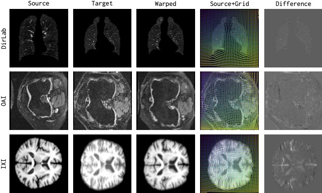
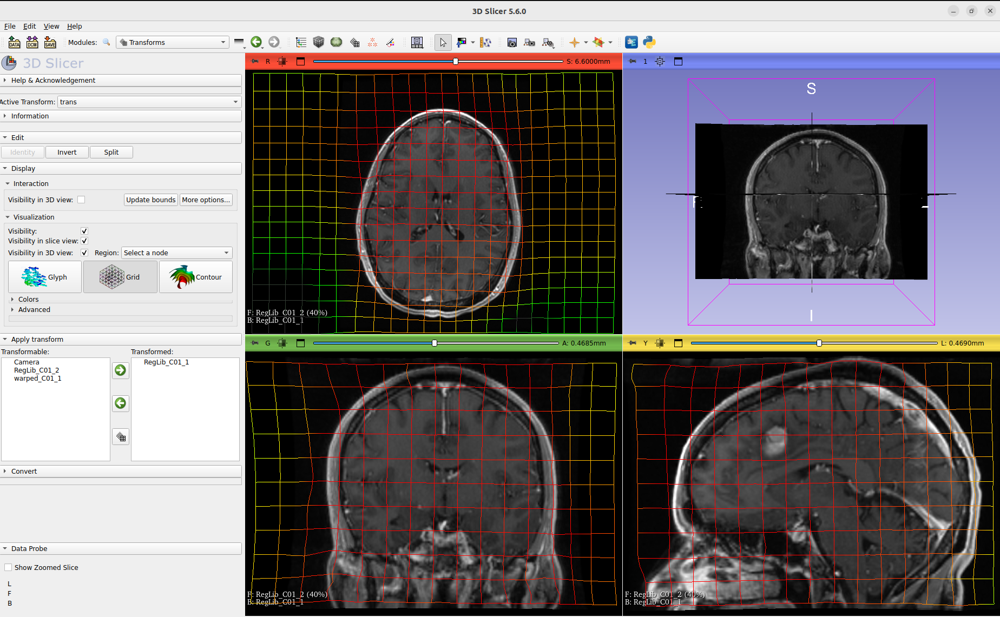

#  uniGradICON: A Foundation Model for Medical Image Registration

[](https://github.com/uncbiag/unigradicon/actions) [](https://arxiv.org/abs/2403.05780)


## News
- 🔥 uniGradICON [Slicer Extension](#-inference-via-slicer-extension) is available in [3D Slicer](https://www.slicer.org/) 5.7.0 Extensions Manager (12/2024)
- 🏆 multiGradICON wins the best oral presentation at 2024 MICCAI Workshop for Biomedical Image Registration (WBIR) (10/2024)
- 🔥 uniGradICON has been used as a baseline in [LUMIR Brain MRI Registration Challenge](https://github.com/JHU-MedImage-Reg/LUMIR_L2R) (6/2024)


## Introduction
`uniGradICON` is based on [GradICON](https://github.com/uncbiag/ICON) but trained on several different datasets (see details below). 
The result is a deep-learning-based registration model that works well across datasets. More results can be found [here](/demos/Examples.md). To get you started quickly there is also an easy to use [Slicer extension](#-inference-via-slicer-extension). 

<div align="center">

</div>


This is the repository for the following papers

**uniGradICON: A Foundation Model for Medical Image Registration**  
Tian, Lin and Greer, Hastings and Kwitt, Roland and Vialard, Francois-Xavier and Estepar, Raul San Jose and Bouix, Sylvain and Rushmore, Richard and Niethammer, Marc  
_MICCAI 2024_ https://arxiv.org/abs/2403.05780  

**multiGradICON: A Foundation Model for Multimodal Medical Image Registration**  
Demir, Basar and Tian, Lin and Greer, Thomas Hastings and Kwitt, Roland and Vialard, Francois-Xavier and Estepar, Raul San Jose and Bouix, Sylvain and Rushmore, Richard Jarrett and Ebrahim, Ebrahim and Niethammer, Marc  
_MICCAI Workshop on Biomedical Image Registration (WBIR) 2024_ https://arxiv.org/abs/2408.00221  

## Easy to use and install
The pre-trained uniGradICON and multiGradICON can be used via [CLI](#-inference-via-cli), [colab notebook](#-inference-via-colab-notebook), and [Slicer Extension](#-inference-via-slicer-extension). The model weights will be downloaded automatically. You can also find the model weights [here](https://github.com/uncbiag/uniGradICON/releases).

### 👉 Inference via CLI
Installation

```
python3 -m venv unigradicon_virtualenv
source unigradicon_virtualenv/bin/activate

pip install unigradicon
```

To register one pair of image
```
wget https://www.hgreer.com/assets/slicer_mirror/RegLib_C01_1.nrrd
wget https://www.hgreer.com/assets/slicer_mirror/RegLib_C01_2.nrrd

unigradicon-register --fixed=RegLib_C01_2.nrrd --fixed_modality=mri --moving=RegLib_C01_1.nrrd --moving_modality=mri --transform_out=trans.hdf5 --warped_moving_out=warped_C01_1.nrrd
```

To register without instance optimization (IO)
```
unigradicon-register --fixed=RegLib_C01_2.nrrd --fixed_modality=mri --moving=RegLib_C01_1.nrrd --moving_modality=mri --transform_out=trans.hdf5 --warped_moving_out=warped_C01_1.nrrd --io_iterations None
```

To use a different similarity measure in the IO. We currently support three similarity measures
- LNCC: lncc
- Squared LNCC: lncc2
- MIND SSC: mind
```
unigradicon-register --fixed=RegLib_C01_2.nrrd --fixed_modality=mri --moving=RegLib_C01_1.nrrd --moving_modality=mri --transform_out=trans.hdf5 --warped_moving_out=warped_C01_1.nrrd --io_iterations 50 --io_sim lncc2
```

To load specific model weight in the inference. We currently support uniGradICON and multiGradICON.
```
unigradicon-register --fixed=RegLib_C01_2.nrrd --fixed_modality=mri --moving=RegLib_C01_1.nrrd --moving_modality=mri --transform_out=trans.hdf5 --warped_moving_out=warped_C01_1.nrrd --model multigradicon
```

To mask out the background using the provided segmentation before registration (segmentations for both moving and fixed images are necessary for accurate registration):
```
unigradicon-register --fixed=RegLib_C01_2.nrrd --fixed_modality=mri --fixed_segmentation=[fixed_image_segmentation_file_name] --moving=RegLib_C01_1.nrrd --moving_modality=mri --moving_segmentation=[moving_image_segmentation_file_name] --transform_out=trans.hdf5 --warped_moving_out=warped_C01_1.nrrd --io_iterations None
```

To apply loss function masking using the provided segmentations in the IO:
```
unigradicon-register --fixed=RegLib_C01_2.nrrd --fixed_modality=mri --fixed_segmentation=[fixed_image_segmentation_file_name] --moving=RegLib_C01_1.nrrd --moving_modality=mri --moving_segmentation=[moving_image_segmentation_file_name] --transform_out=trans.hdf5 --warped_moving_out=warped_C01_1.nrrd --io_iterations 50 --io_sim lncc2 --loss_function_masking
```

This loss function ensures proper intensity adjustments for registration tasks requiring mass conservation, utilizing the change of variables rule from integration. To be effective, images must be in an intensity space where conservation holds. This loss function is specifically valid for CT modality, where -1000 HU represents air. To apply determinant-based intensity correction during registration in the IO:
```
unigradicon-register --fixed=RegLib_C01_2.nrrd --fixed_modality=mri --fixed_segmentation=[fixed_image_segmentation_file_name] --moving=RegLib_C01_1.nrrd --moving_modality=mri --moving_segmentation=[moving_image_segmentation_file_name] --transform_out=trans.hdf5 --warped_moving_out=warped_C01_1.nrrd --io_iterations 50 --io_sim lncc2 --intensity_conservation_loss
```

To warp an image
```
unigradicon-warp --fixed [fixed_image_file_name] --moving [moving_image_file_name]  --transform trans.hdf5 --warped_moving_out warped.nii.gz --linear
```
To warp a label map

```
unigradicon-warp --fixed [fixed_image_file_name] --moving [moving_image_segmentation_file_name]  --transform trans.hdf5 --warped_moving_out warped_seg.nii.gz --nearest_neighbor
```

### 👉 Inference via colab notebook
We provide a [colab notebook](https://colab.research.google.com/drive/1O4F0j_ZaRHxyFJ-pfApl2E1_47-wzxMj#offline=true&sandboxMode=true) where the users can directly access and visualize the output of uniGradICON network. 

### 👉 Inference via Slicer Extension

A Slicer extensions is available [here](https://github.com/uncbiag/SlicerUniGradICON?tab=readme-ov-file). It is an official Slicer Extension and can be installed via the Slicer Extension Manager. This requires Slicer >=5.7.0. Please make sure to install the Slicer PyTorch extension before as uniGradICON depends on it.


## Training and testing data

`uniGradICON` has currently been trained and tested on the following datasets.

**Training data:**
<table>
    <tr>
        <td> </td>
        <td>Dataset</td>
        <td>Anatomical region</td>
        <td># of patients</td>
        <td># per patient</td>
        <td># of pairs</td>
        <td>Type</td>
        <td>Modality</td>
    </tr>
    <tr>
        <td>1.</td> 
        <td>COPDGene</td>
        <td>Lung</td>
        <td>899</td>
        <td>2</td>
        <td>899</td>
        <td>Intra-pat.</td>
        <td>CT</td>
    </tr>
    <tr>
        <td>2.</td> 
        <td>OAI</td>
        <td>Knee</td>
        <td>2532</td>
        <td>1</td>
        <td>3,205,512</td>
        <td>Inter-pat.</td>
        <td>MRI</td>
    </tr>
    <tr>
        <td>3.</td> 
        <td>HCP</td>
        <td>Brain</td>
        <td>1076</td>
        <td>1</td>
        <td>578,888</td>
        <td>Inter-pat.</td>
        <td>MRI</td>
    </tr>
    <tr>
        <td>4.</td>
        <td>L2R-Abdomen</td>
        <td>Abdomen</td>
        <td>30</td>
        <td>1</td>
        <td>450</td>
        <td>Inter-pat.</td>
        <td>CT</td>
    </tr>
</table>

**Testing data:**
<table>
    <tr>
        <td> </td>
        <td>Dataset</td>
        <td>Anatomical region</td>
        <td># of patients</td>
        <td># per patient</td>
        <td># of pairs</td>
        <td>Type</td>
        <td>Modality</td>
    </tr>     
    <tr>
        <td>5.</td>
        <td>Dirlab-COPDGene</td>
        <td>Lung</td>
        <td>10</td>
        <td>2</td>
        <td>10</td>
        <td>Intra-pat.</td>
        <td>CT</td>
    </tr>
    <tr>
        <td>6.</td>
        <td>OAI-test</td>
        <td>Knee</td>
        <td>301</td>
        <td>1</td>
        <td>301</td>
        <td>Inter-pat.</td>
        <td>MRI</td>
    </tr>
    <tr>
        <td>7.</td>
        <td>HCP-test</td>
        <td>Brain</td>
        <td>32</td>
        <td>1</td>
        <td>100</td>
        <td>Inter-pat.</td>
        <td>MRI</td>
    </tr>
    <tr>
        <td>8.</td>
        <td>L2R-NLST-val</td>
        <td>Lung</td>
        <td>10</td>
        <td>2</td>
        <td>10</td>
        <td>Intra-pat.</td>
        <td>CT</td>
    </tr>
    <tr>
        <td>9.</td>
        <td>L2R-OASIS-val</td>
        <td>Brain</td>
        <td>20</td>
        <td>1</td>
        <td>19</td>
        <td>Inter-pat.</td>
        <td>MRI</td>
    </tr>
    <tr>
        <td>10.</td>
        <td>IXI-test</td>
        <td>Brain</td>
        <td>115</td>
        <td>1</td>
        <td>115</td>
        <td>Atlas-pat.</td>
        <td>MRI</td>
    </tr>
    <tr>
        <td>11.</td>
        <td>L2R-CBCT-val</td>
        <td>Lung</td>
        <td>3</td>
        <td>3</td>
        <td>6</td>
        <td>Intra-pat.</td>
        <td>CT/CBCT</td>
    </tr>
    <tr>
        <td>12.</td>
        <td>L2R-CTMR-val</td>
        <td>Abdomen</td>
        <td>3</td>
        <td>2</td>
        <td>3</td>
        <td>Intra-pat.</td>
        <td>CT/MRI</td>
    </tr>
    <tr>
        <td>13.</td>
        <td>L2R-CBCT-train</td>
        <td>Lung</td>
        <td>3</td>
        <td>11</td>
        <td>22</td>
        <td>Intra-pat.</td>
        <td>CT/CBCT</td>
    </tr>
</table>

## Get involved

Our goal is to continuously improve the `uniGradICON` model, e.g., by training on more datasets with additional diversity. Feel free to point us to datasets that should be included or let us know if you want to help with future developments.


## Visualization

`UniGradICON` is set up to work with [Itk](https://itk.org/) images and transforms. So you can easily read and write images and display resulting transformations for example in [3D Slicer](https://www.slicer.org/).

The result can be viewed in 3D Slicer:
<div align="center">

</div>

## 📄 Citation
If you find this repository useful, please consider citing:
```
@inproceedings{tian2024unigradicon,
  title={unigradicon: A foundation model for medical image registration},
  author={Tian, Lin and Greer, Hastings and Kwitt, Roland and Vialard, Fran{\c{c}}ois-Xavier and San Jos{\'e} Est{\'e}par, Ra{\'u}l and Bouix, Sylvain and Rushmore, Richard and Niethammer, Marc},
  booktitle={International Conference on Medical Image Computing and Computer-Assisted Intervention},
  pages={749--760},
  year={2024},
  organization={Springer}
}
```
```
@inproceedings{demir2024multigradicon,
  title={MultiGradICON: A foundation model for multimodal medical image registration},
  author={Demir, Ba{\c{s}}ar and Tian, Lin and Greer, Hastings and Kwitt, Roland and Vialard, Fran{\c{c}}ois-Xavier and Est{\'e}par, Ra{\'u}l San Jos{\'e} and Bouix, Sylvain and Rushmore, Richard and Ebrahim, Ebrahim and Niethammer, Marc},
  booktitle={International Workshop on Biomedical Image Registration},
  pages={3--18},
  year={2024},
  organization={Springer}
}
```

