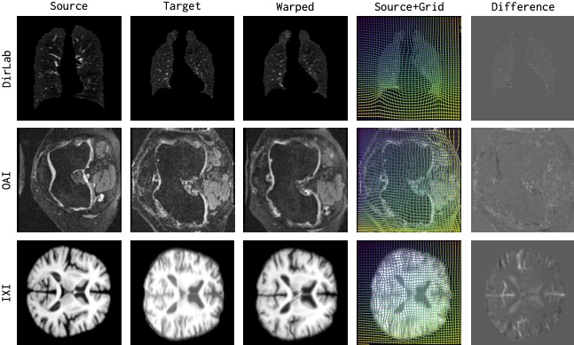
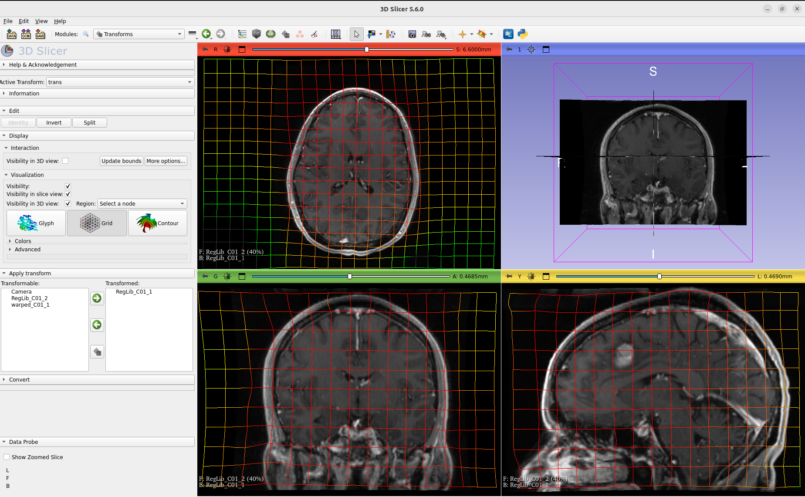

#  uniGradICON: A Foundation Model for Medical Image Registration

[](https://github.com/uncbiag/unigradicon/actions) [](https://arxiv.org/abs/2403.05780)


## News
- 🔥 uniGradICON [Slicer Extension](#-inference-via-slicer-extension) is available in [3D Slicer](https://www.slicer.org/) 5.7.0 Extensions Manager (12/2024)
- 🏆 multiGradICON wins the best oral presentation at 2024 MICCAI Workshop for Biomedical Image Registration (WBIR) (10/2024)
- 🔥 uniGradICON has been used as a baseline in [LUMIR Brain MRI Registration Challenge](https://github.com/JHU-MedImage-Reg/LUMIR_L2R) (6/2024)


## Introduction
`uniGradICON` is based on [GradICON](https://github.com/uncbiag/ICON) but trained on several different datasets (see details below). 
The result is a deep-learning-based registration model that works well across datasets. More results can be found [here](/demos/Examples.md). To get you started quickly there is also an easy to use [Slicer extension](#-inference-via-slicer-extension). 

<div align="center">

</div>


This is the repository for the following papers

**uniGradICON: A Foundation Model for Medical Image Registration**  
Tian, Lin and Greer, Hastings and Kwitt, Roland and Vialard, Francois-Xavier and Estepar, Raul San Jose and Bouix, Sylvain and Rushmore, Richard and Niethammer, Marc  
_MICCAI 2024_ https://arxiv.org/abs/2403.05780  

**multiGradICON: A Foundation Model for Multimodal Medical Image Registration**  
Demir, Basar and Tian, Lin and Greer, Thomas Hastings and Kwitt, Roland and Vialard, Francois-Xavier and Estepar, Raul San Jose and Bouix, Sylvain and Rushmore, Richard Jarrett and Ebrahim, Ebrahim and Niethammer, Marc  
_MICCAI Workshop on Biomedical Image Registration (WBIR) 2024_ https://arxiv.org/abs/2408.00221  

## Easy to use and install
The pre-trained uniGradICON and multiGradICON can be used via [CLI](#-inference-via-cli), [colab notebook](#-inference-via-colab-notebook), and [Slicer Extension](#-inference-via-slicer-extension). The model weights will be downloaded automatically. You can also find the model weights [here](https://github.com/uncbiag/uniGradICON/releases).

### 👉 Inference via CLI
Installation

```
python3 -m venv unigradicon_virtualenv
source unigradicon_virtualenv/bin/activate

pip install unigradicon
```

To register one pair of images
```
wget https://www.hgreer.com/assets/slicer_mirror/RegLib_C01_1.nrrd
wget https://www.hgreer.com/assets/slicer_mirror/RegLib_C01_2.nrrd

unigradicon-register --fixed=RegLib_C01_2.nrrd --fixed_modality=mri --moving=RegLib_C01_1.nrrd --moving_modality=mri --transform_out=trans.hdf5 --warped_moving_out=warped_C01_1.nrrd
```

To register without instance optimization (IO)
```
unigradicon-register --fixed=RegLib_C01_2.nrrd --fixed_modality=mri --moving=RegLib_C01_1.nrrd --moving_modality=mri --transform_out=trans.hdf5 --warped_moving_out=warped_C01_1.nrrd --io_iterations 'None'
```

To use a different similarity measure in the IO. We currently support three similarity measures
- LNCC: lncc
- Squared LNCC: lncc2
- MIND SSC: mind
```
unigradicon-register --fixed=RegLib_C01_2.nrrd --fixed_modality=mri --moving=RegLib_C01_1.nrrd --moving_modality=mri --transform_out=trans.hdf5 --warped_moving_out=warped_C01_1.nrrd --io_iterations 50 --io_sim lncc2
```

To change the instance optimization learning rate, use `--io_lr` (default is `0.00002`; must be positive). You can try increasing `--io_lr` while lowering `--io_iterations`; this may reduce runtime while giving similar registration quality.
```
unigradicon-register --fixed=RegLib_C01_2.nrrd --fixed_modality=mri --moving=RegLib_C01_1.nrrd --moving_modality=mri --transform_out=trans.hdf5 --warped_moving_out=warped_C01_1.nrrd --io_iterations 50 --io_lr 0.00002
```

To load specific model weights during inference. We currently support uniGradICON and multiGradICON.
```
unigradicon-register --fixed=RegLib_C01_2.nrrd --fixed_modality=mri --moving=RegLib_C01_1.nrrd --moving_modality=mri --transform_out=trans.hdf5 --warped_moving_out=warped_C01_1.nrrd --model multigradicon
```

### Masks, Segmentations, and Backward Compatibility

Starting in 1.0.6, binary masks and label-map segmentations have separate CLI arguments:

| Argument | Purpose |
|----------|---------|
| `--fixed_mask`, `--moving_mask` | Binary ROI masks for input masking and/or loss-function masking |
| `--fixed_segmentation`, `--moving_segmentation` | Label maps for Dice loss |
| `--input_masking` | Apply masks to image intensities before registration |
| `--loss_function_masking` | Use masks inside the similarity loss |
| `--dice_loss_weight` | Enable Dice loss using segmentations |

For backward compatibility with 1.0.5 commands, if masks are not provided and segmentations are provided without Dice loss, the segmentations are still accepted as masks. This compatibility path is deprecated; prefer `--fixed_mask` and `--moving_mask` for masking.

To mask out the background before registration, provide binary masks for both moving and fixed images and enable input masking:
```
unigradicon-register --fixed=RegLib_C01_2.nrrd --fixed_modality=mri --fixed_mask=[fixed_image_mask_file_name] --moving=RegLib_C01_1.nrrd --moving_modality=mri --moving_mask=[moving_image_mask_file_name] --transform_out=trans.hdf5 --warped_moving_out=warped_C01_1.nrrd --io_iterations 'None' --input_masking
```

To apply loss function masking in the IO, provide binary masks and set `--loss_function_masking`:
```
unigradicon-register --fixed=RegLib_C01_2.nrrd --fixed_modality=mri --fixed_mask=[fixed_image_mask_file_name] --moving=RegLib_C01_1.nrrd --moving_modality=mri --moving_mask=[moving_image_mask_file_name] --transform_out=trans.hdf5 --warped_moving_out=warped_C01_1.nrrd --io_iterations 50 --io_sim lncc2 --loss_function_masking
```

Input masking and loss masking are independent. If you want masks used for both input preprocessing and loss masking, pass both flags:
```
unigradicon-register ... --input_masking --loss_function_masking
```

Intensity conservation loss ensures proper intensity adjustments for registration tasks requiring mass conservation, utilizing the change of variables rule from integration. This loss function is specifically valid for CT modality, where -1000 HU represents air. To apply this loss function, set the modality to CT and enable the intensity conservation loss flag:
```
unigradicon-register --fixed=RegLib_C01_2.nrrd --fixed_modality=ct --moving=RegLib_C01_1.nrrd --moving_modality=ct --transform_out=trans.hdf5 --warped_moving_out=warped_C01_1.nrrd --io_iterations 50 --io_sim lncc2 --intensity_conservation_loss
```

To optimize using Dice loss for improved anatomical structure alignment, provide segmentations and set a Dice loss weight. When enabled, the system converts the segmentations to one-hot encoding, warps them along with the images, and adds a weighted Dice loss term to the optimization objective. This encourages better alignment of corresponding anatomical structures between images.

The total loss becomes:  
`L_total = lambda * L_inverse_consistency + L_similarity + dice_loss_weight * L_dice`.

This feature is particularly useful for organ registration, brain structure alignment, and other tasks where anatomical correspondence is critical. Note that the model expects segmentations to be single-channel images with the same shape as the input images. The segmentations are automatically converted to one-hot encoding. At least one **non-zero** label id must appear in **both** segmentations (excluding background `0`); otherwise registration fails with a clear error.

```
unigradicon-register --fixed=RegLib_C01_2.nrrd --fixed_modality=mri --fixed_segmentation=[fixed_image_segmentation_file_name] --moving=RegLib_C01_1.nrrd --moving_modality=mri --moving_segmentation=[moving_image_segmentation_file_name] --transform_out=trans.hdf5 --warped_moving_out=warped_C01_1.nrrd --io_iterations 50 --io_sim lncc2 --dice_loss_weight 0.1
```

To use custom network weights (e.g., after [finetuning](src/unigradicon/finetuning/README.md)):
```
unigradicon-register --fixed=fixed.nii.gz --fixed_modality=mri --moving=moving.nii.gz --moving_modality=mri --transform_out=trans.hdf5 --warped_moving_out=warped.nii.gz --network_weights /path/to/network_weights_final.trch
```

If you customized preprocessing during finetuning, pass the same values at inference with `--ct_window` (for CT) or `--quantile_range` (for MRI). The resulting intensity range after clamping must have max greater than min (for example, avoid equal `ct_window` bounds or a degenerate quantile range).
```
unigradicon-register --fixed=fixed.nii.gz --fixed_modality=mri --moving=moving.nii.gz --moving_modality=mri --transform_out=trans.hdf5 --quantile_range 0.0 0.99 --network_weights /path/to/network_weights_final.trch
```

To finetune on your own data, see the [finetuning guide](./src/unigradicon/finetuning/README.md):
```
unigradicon-finetune --config /path/to/config.yaml
```

To warp an image
```
unigradicon-warp --fixed [fixed_image_file_name] --moving [moving_image_file_name] --transform trans.hdf5 --warped_moving_out warped.nii.gz --linear
```
To warp a label map

```
unigradicon-warp --fixed [fixed_image_file_name] --moving [moving_image_segmentation_file_name] --transform trans.hdf5 --warped_moving_out warped_seg.nii.gz --nearest_neighbor
```

### 👉 Inference via colab notebook
We provide a [colab notebook](https://colab.research.google.com/drive/1O4F0j_ZaRHxyFJ-pfApl2E1_47-wzxMj#offline=true&sandboxMode=true) where the users can directly access and visualize the output of uniGradICON network. 

### 👉 Inference via Slicer Extension

A Slicer extension is available [here](https://github.com/uncbiag/SlicerUniGradICON?tab=readme-ov-file). It is an official Slicer Extension and can be installed via the Slicer Extension Manager. This requires Slicer >=5.7.0. Please make sure to install the Slicer PyTorch extension first, since uniGradICON depends on it.

## Training and testing data

`uniGradICON` has currently been trained and tested on the following datasets.

**Training data:**
<table>
    <tr>
        <td> </td>
        <td>Dataset</td>
        <td>Anatomical region</td>
        <td># of patients</td>
        <td># per patient</td>
        <td># of pairs</td>
        <td>Type</td>
        <td>Modality</td>
    </tr>
    <tr>
        <td>1.</td> 
        <td>COPDGene</td>
        <td>Lung</td>
        <td>899</td>
        <td>2</td>
        <td>899</td>
        <td>Intra-pat.</td>
        <td>CT</td>
    </tr>
    <tr>
        <td>2.</td> 
        <td>OAI</td>
        <td>Knee</td>
        <td>2532</td>
        <td>1</td>
        <td>3,205,512</td>
        <td>Inter-pat.</td>
        <td>MRI</td>
    </tr>
    <tr>
        <td>3.</td> 
        <td>HCP</td>
        <td>Brain</td>
        <td>1076</td>
        <td>1</td>
        <td>578,888</td>
        <td>Inter-pat.</td>
        <td>MRI</td>
    </tr>r
```
    <tr>
        <td>4.</td>
        <td>L2R-Abdomen</td>
        <td>Abdomen</td>
        <td>30</td>
        <td>1</td>
        <td>450</td>
        <td>Inter-pat.</td>
        <td>CT</td>
    </tr>
</table>

**Testing data:**
<table>
    <tr>
        <td> </td>
        <td>Dataset</td>
        <td>Anatomical region</td>
        <td># of patients</td>
        <td># per patient</td>
        <td># of pairs</td>
        <td>Type</td>
        <td>Modality</td>
    </tr>     
    <tr>
        <td>5.</td>
        <td>Dirlab-COPDGene</td>
        <td>Lung</td>
        <td>10</td>
        <td>2</td>
        <td>10</td>
        <td>Intra-pat.</td>
        <td>CT</td>
    </tr>
    <tr>
        <td>6.</td>
        <td>OAI-test</td>
        <td>Knee</td>
        <td>301</td>
        <td>1</td>
        <td>301</td>
        <td>Inter-pat.</td>
        <td>MRI</td>
    </tr>
    <tr>
        <td>7.</td>
        <td>HCP-test</td>
        <td>Brain</td>
        <td>32</td>
        <td>1</td>
        <td>100</td>
        <td>Inter-pat.</td>
        <td>MRI</td>
    </tr>
    <tr>
        <td>8.</td>
        <td>L2R-NLST-val</td>
        <td>Lung</td>
        <td>10</td>
        <td>2</td>
        <td>10</td>
        <td>Intra-pat.</td>
        <td>CT</td>
    </tr>
    <tr>
        <td>9.</td>
        <td>L2R-OASIS-val</td>
        <td>Brain</td>
        <td>20</td>
        <td>1</td>
        <td>19</td>
        <td>Inter-pat.</td>
        <td>MRI</td>
    </tr>
    <tr>
        <td>10.</td>
        <td>IXI-test</td>
        <td>Brain</td>
        <td>115</td>
        <td>1</td>
        <td>115</td>
        <td>Atlas-pat.</td>
        <td>MRI</td>
    </tr>
    <tr>
        <td>11.</td>
        <td>L2R-CBCT-val</td>
        <td>Lung</td>
        <td>3</td>
        <td>3</td>
        <td>6</td>
        <td>Intra-pat.</td>
        <td>CT/CBCT</td>
    </tr>
    <tr>
        <td>12.</td>
        <td>L2R-CTMR-val</td>
        <td>Abdomen</td>
        <td>3</td>
        <td>2</td>
        <td>3</td>
        <td>Intra-pat.</td>
        <td>CT/MRI</td>
    </tr>
    <tr>
        <td>13.</td>
        <td>L2R-CBCT-train</td>
        <td>Lung</td>
        <td>3</td>
        <td>11</td>
        <td>22</td>
        <td>Intra-pat.</td>
        <td>CT/CBCT</td>
    </tr>
</table>

## Finetuning

You can finetune the `uniGradICON` model on your own data using the [finetuning guide](./src/unigradicon/finetuning/README.md).

## Get involved

Our goal is to continuously improve the `uniGradICON` model, e.g., by training on more datasets with additional diversity. Feel free to point us to datasets that should be included or let us know if you want to help with future developments.

## Visualization

`UniGradICON` is set up to work with [Itk](https://itk.org/) images and transforms. So you can easily read and write images and display resulting transformations for example in [3D Slicer](https://www.slicer.org/).

The result can be viewed in 3D Slicer:
<div align="center">

</div>

## 📄 Citation
If you find this repository useful, please consider citing:
```
@inproceedings{tian2024unigradicon,
  title={unigradicon: A foundation model for medical image registration},
  author={Tian, Lin and Greer, Hastings and Kwitt, Roland and Vialard, Fran{\c{c}}ois-Xavier and San Jos{\'e} Est{\'e}par, Ra{\'u}l and Bouix, Sylvain and Rushmore, Richard and Niethammer, Marc},
  booktitle={International Conference on Medical Image Computing and Computer-Assisted Intervention},
  pages={749--760},
  year={2024},
  organization={Springer}
}
```
```
@inproceedings{demir2024multigradicon,
  title={MultiGradICON: A foundation model for multimodal medical image registration},
  author={Demir, Ba{\c{s}}ar and Tian, Lin and Greer, Hastings and Kwitt, Roland and Vialard, Fran{\c{c}}ois-Xavier and Est{\'e}par, Ra{\'u}l San Jos{\'e} and Bouix, Sylvain and Rushmore, Richard and Ebrahim, Ebrahim and Niethammer, Marc},
  booktitle={International Workshop on Biomedical Image Registration},
  pages={3--18},
  year={2024},
  organization={Springer}
}
```
